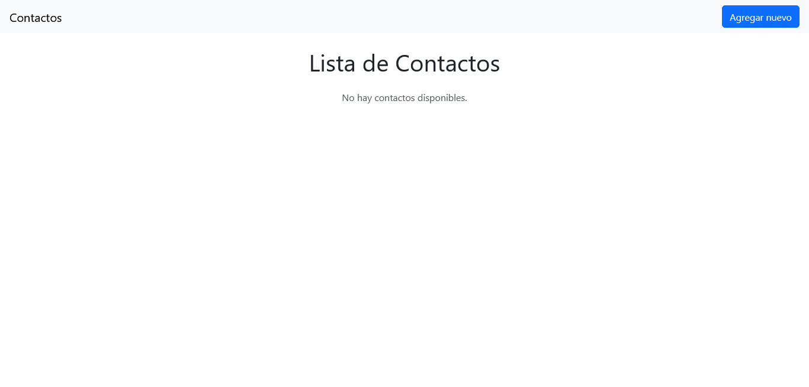
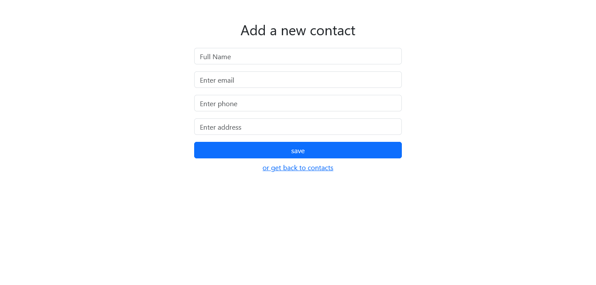
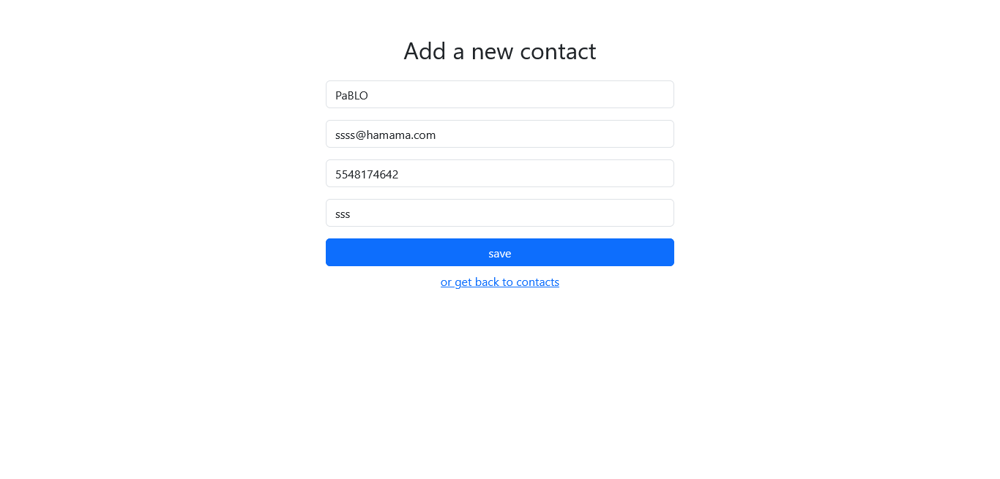
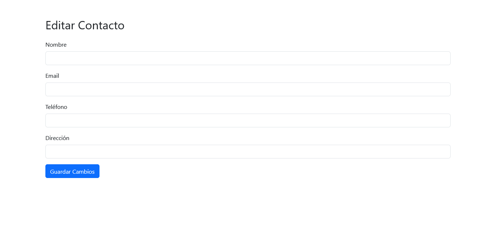
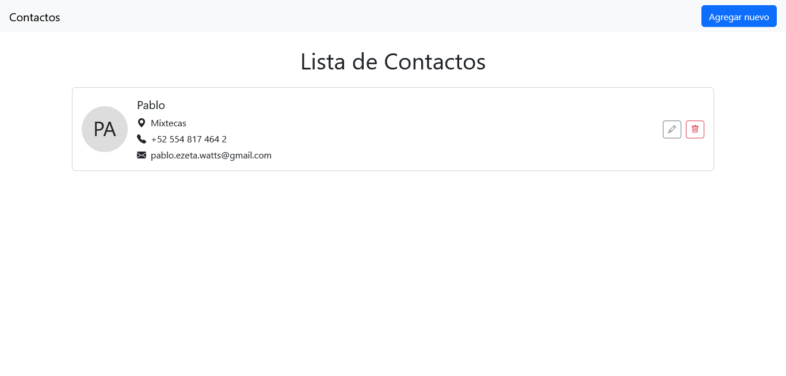
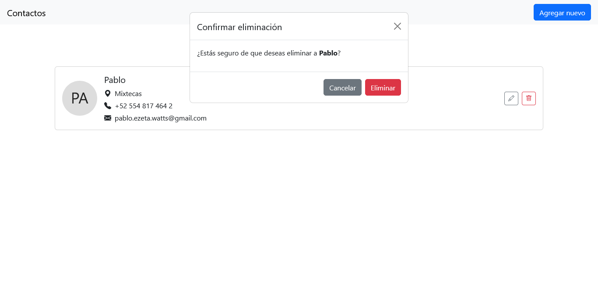

## 🙋‍♂️ Author

**Pablo Ezeta**
Full Stack Developer

---

##  Aplicación de Gestión de Contactos

Una aplicación web moderna para gestionar tu lista de contactos personales. Desarrollada con **React**, **React Router** y **Context API**, permite crear, leer, actualizar y eliminar (CRUD) contactos de forma sencilla. Usa la API pública de [4Geeks Contact List API](https://playground.4geeks.com/contact/docs).

---

## Funcionalidades

- 🧾 Lista tus contactos guardados con nombre, teléfono, dirección y correo.
- ➕ Agrega nuevos contactos desde un formulario.
- ✏️ Edita los detalles de contactos existentes.
- 🗑️ Elimina contactos con confirmación desde un modal.
- 🔄 Persistencia de datos vía llamadas a una API REST.
- 🎨 Interfaz responsiva y limpia basada en Bootstrap.

---

## Tecnologías

- React
- React Router DOM  c
- Context API
- Bootstrap 5
- JavaScript (ES6)
- Vite

## Los pasos

Paso 1 

Paso 2 

Paso 3 

Paso 4 

Paso 5 

Paso 6 

Paso 7 
